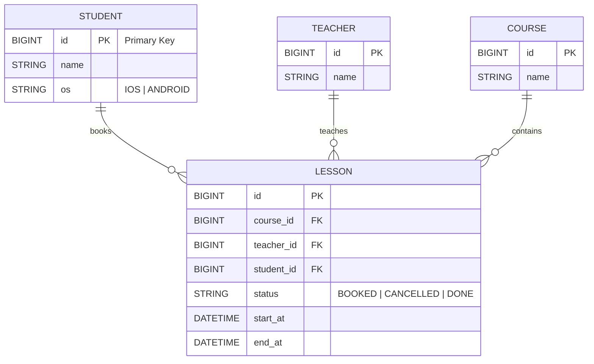
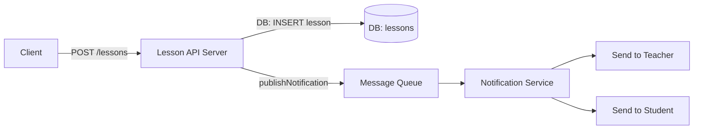

# 랭디 백엔드 과제

## 📘 개요

Spring Boot 기반 백엔드 과제 프로젝트입니다.
학생(Student)이 원하는 코스(Course)를 선택하고, 특정 시간에 해당 코스를 담당할 선생님(Teacher)을 지정하여 수업(Lesson)을 예약하는 구조를 구현합니다.

- 수업 길이: **20분**
- 수업 시작 가능 시각: **매시 00, 30분**
- 모든 선생님은 모든 코스를 진행 가능하다고 가정합니다.

---

## 🧩 기술 스택

<div style="text-align:center">
  
  
  
  
  
  
</div>

> Kotlin으로 구현 (Kotlin 1.9.25), Java 21 toolchain 사용

---

## 🧠 ERD
다음은 도메인 ERD(mermaid)를 통한 시각화입니다. GitHub의 Markdown/mermaid 렌더링 환경이나 Mermaid 지원 뷰어에서 다이어그램이 표시됩니다.



## 🚀 TASK

### TASK #1 — 수업 가능한 선생님 조회

- 엔드포인트
  - GET /api/teachers/available?courseId={id}&startAt={datetime}
  - 예: GET /api/teachers/available?courseId=1&startAt=2025-11-09T09:00

- 입력 검증
  - startAt 의 분(minute)은 00 또는 30 이어야 합니다. (예외: INVALID_START_AT_MINUTE)
  - 날짜/시간 포맷: yyyy-MM-dd'T'HH:mm:ss (Controller에서 @DateTimeFormat 사용)


### TASK #2 — 수업 신청

- 엔드포인트
  - POST /api/lessons
  - 헤더: X-Student-Id: {studentId}
  - Body (JSON):

```json
{
  "startAt": "2025-11-09T09:00:00",
  "courseId": 1,
  "teacherId": 2
}
```

- 입력 검증 및 정책
  - startAt 은 분(minute)이 00 또는 30 이어야 하며, 초(second)와 나노초(nano)는 0 이어야 합니다.
  - 요청의 studentId 는 HTTP 헤더 `X-Student-Id`로 전달됩니다.
  - 선생님과 학생 모두 해당 시간에 이미 BOOKED 상태의 수업이 없어야 합니다.


- 예외 및 상태 코드
  - 성공 시: 201 Created + 생성된 Lesson 정보
  - INVALID_START_AT / INVALID_START_AT_MINUTE: 잘못된 시작 시각 포맷(400)
  - TEACHER_NOT_FOUND / STUDENT_NOT_FOUND / COURSE_NOT_FOUND: 리소스 없음(404)
  - TEACHER_ALREADY_BOOKED / STUDENT_ALREADY_BOOKED: 예약 충돌(409)

---

### TASK #3 알림(Notifications) 설계

수업 신청이 완료된 후, 학습자(student)와 선생님(teacher)에게 알림을 발송합니다.

####  요구사항
- 수업 신청이 완료된 후, 학습자와 선생님에게 알림을 발송해야 합니다.
- 알림 발송은 `publishNotification(...)`를 통해 이벤트를 발행/전달하는 방식으로 구현합니다.

####  간단 흐름 다이어그램



#### 설계 방향 요약
1) 비동기 처리 필요성
- 알림 발송(SMS/푸시/이메일 등)은 외부 호출이 수반되어 느릴 수 있으므로, 수업 생성 트랜잭션과 분리해 비동기로 처리합니다.
- 이렇게 하면 API 응답 지연을 방지하고 알림 실패가 메인 비즈니스에 영향을 주지 않습니다.

2) 이벤트 발행 구조
- 수업 생성 성공 시 `LessonCreatedEvent`를 발행합니다.
- `publishNotification(event)`는 이 이벤트를 메시지 브로커(예: Kafka, RabbitMQ, AWS SQS)에 전달합니다.
- 알림 서비스(또는 워커)가 브로커에서 해당 이벤트를 구독하고 실제 알림을 처리합니다.
```text
const lesson = createLesson(...);
publishNotification({
    type: "LESSON_CREATED",
    data: {
        lessonId: lesson.id,
        teacherId: lesson.teacherId,
        studentId: lesson.studentId,
        startAt: lesson.startAt
    }
});
```
3) 알림 서비스 (Notification Service)
- 별도의 마이크로서비스 또는 백그라운드 워커로 구성합니다.
- 메시지 브로커에서 `LESSON_CREATED` 이벤트를 받아 처리:
  - 선생님: "새로운 수업이 등록되었습니다" 알림 발송
  - 학생: "수업 신청이 완료되었습니다" 알림 발송
- 내부에서 채널별 분기 처리 (푸시 / SMS / 이메일 등)

```text
if (teacherId) -> push 알림 or 이메일
if (studentId) -> 앱 알림 or SMS

```
4) 장점
- API 응답 속도 개선: 알림 로직이 요청 처리 시간에 영향을 주지 않음
- 장애 격리: 알림 서비스 문제 시에도 수업 생성은 정상 처리
- 확장성: 이벤트 유형 추가 및 다양한 알림 채널 확장 용이

5) 구현/인프라 예시
- 메시지 브로커: AWS SQS, RabbitMQ, Kafka 등
- Notification Worker: Node.js, Spring Boot, NestJS, 또는 서버리스 함수(Lambda 등)
- `publishNotification()` 내부: 브로커에 메시지를 JSON 형태로 push


####  운영상 고려사항 (추가)
- 중복 방지: 메시지를 여러 번 처리할 수 있으므로 idempotency 키 또는 상태 검증 필요
- 재시도 정책: 알림 전송 실패 시 재시도 전략
- 관찰성: 이벤트 발행/처리 로그, 메트릭, 알림 전송 성공률 모니터링
- 보안/비밀관리: 외부 알림 서비스 API 키는 시크릿 매니저로 관리

####  요청 처리에서의 구현 위치
- `publishNotification(...)`는 서비스 계층에서 호출 (수업 저장 직후)
- 동기적으로 알림을 보내지 않고 메시지 브로커로 위임하는 형태로 구현

---

### 개발 환경 실행 (Mac / Windows)

이 프로젝트는 개발 편의를 위해 MySQL 컨테이너를 정의한 `docker-compose.dev.yml` 파일을 제공합니다. 아래 방법으로 개발용 DB를 띄우고, 로컬에서 애플리케이션을 실행해 연결할 수 있습니다.

사전 요구사항
- Docker (또는 Docker Desktop) 설치
- 로컬에 Gradle Wrapper(`gradlew` / `gradlew.bat`)가 존재

1) 개발용 MySQL 컨테이너 기동
- macOS / Linux (bash, zsh 등):

```bash
# 프로젝트 루트에서
docker compose -f docker-compose.dev.yml up -d
```

- Windows (cmd.exe):

```cmd
docker-compose -f docker-compose.dev.yml up -d
```
